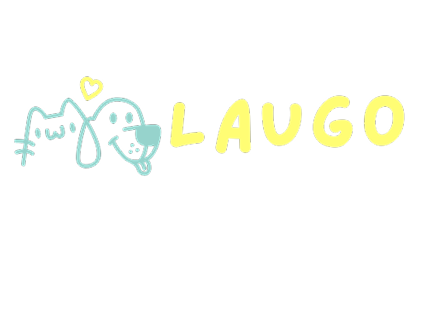
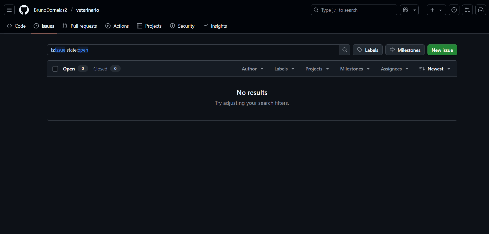
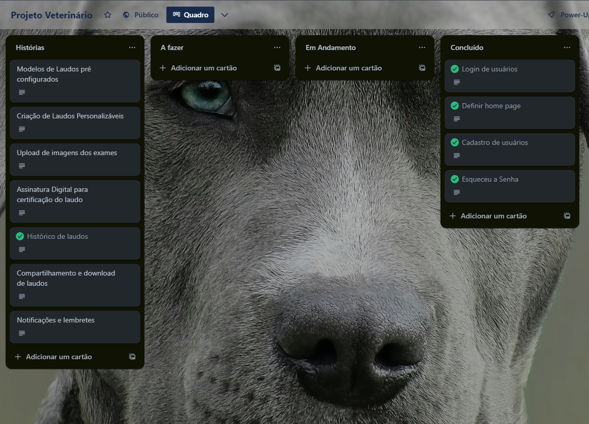

  

    
  

## 🐶 Sobre o Projeto

LauGO é um sistema moderno e intuitivo que revoluciona a geração de laudos veterinários para exames de ultrassonografia e radiográfico. Com automação inteligente, modelos pré-configurados e personalizáveis, assinatura digital e compartilhamento fácil, ele agiliza o trabalho dos especialistas, garantindo precisão e eficiência nos diagnósticos. Uma solução completa para clínicas e profissionais que buscam qualidade, praticidade e inovação.

## 🐱 Funcionalidades
- Cadastro e Login Seguro
- Criação e Personalização de Laudos
- Modelos Pré-configurados de Laudos
- Diagnósticos Pré-configurados
- Upload e Armazenamento de Imagens (USG e Raio-X)
- Histórico e Busca Rápida de Laudos
- Assinatura Digital para Certificação
- Compartilhamento e Download de Laudos

## 🐰 Instruções para Utilização e Navegação da Aplicação

1. Primeiro precisamos instalar o Visual Studio Code (VS Code)
    Passo 1: Acesse o site oficial do VS Code: 

    🔗 https://code.visualstudio.com

    Passo 2: Clique no botão "Download for Windows" (ou escolha seu sistema operacional).

    Passo 3: Após o download, execute o instalador e siga os passos:

    - Aceite os termos.

    - Escolha o local da instalação (pode deixar padrão).

    - Marque a opção "Add to PATH" (caso disponível).
    
    Conclua a instalação.

 

2. Instalar o Node.js
    Passo 1: Acesse o site oficial do Node.js:
    🔗 https://nodejs.org

    Passo 2: Clique em "LTS (Recommended for most users)".

    Passo 3: Após o download, execute o instalador e siga os passos:

    - Aceite os termos.

    - Mantenha as opções padrão.

    - Finalize a instalação.

    Passo 4: Verifique se o Node.js foi instalado corretamente:
    Abra o terminal (ou o PowerShell) e digite: "node -v" e veja se aparece alguma versão. Faça o mesmo com o "npm -v" e veja se aparece alguma versão.

 

3. Baixar a última versão do projeto no GitHub.
    Passo 1: Acesse o repositório do projeto LauGO no GitHub.

    Passo 2:Clique no botão "Code" (verde) e depois em "Download ZIP".

    Passo 3:Extraia o conteúdo do arquivo .zip para uma pasta de sua preferência no seu computador.

 

4.  Abrir o projeto no VS Code
    Passo 1: Abra o VS Code.

    Passo 2: Vá em Arquivo > Abrir Pasta... e selecione a pasta que você extraiu.

    Passo 3: Aguarde o VS Code carregar o projeto.

 

5.  Instalar as dependências do projeto (apenas na primeira vez)
    Passo 1: No VS Code, pressione [Ctrl + aspas] ou vá em Terminal > Novo Terminal para abrir o terminal integrado.

    Passo 2: No terminal, execute o comando:
    - npm install

    Espere a instalação finalizar e execute o próximo comando:
    - npm instal react-router-dom

 

6.  Executar o projeto localmente
    Passo 1: Ainda no terminal, após a instalação dos pacotes npm essenciais, digite:
    - npm run dev

    Passo 2: Aguarde até aparecer uma mensagem como:
    - Local: "http://localhost:5173/"

    Passo3: Clique no link (ou copie e cole no navegador).  

## 🐻 Issue Bug Tracker

1.  Acesse seu repositório no GitHub

    Vá para o repositório onde está seu projeto.

2.  Clique na aba Issues

    Está localizada no topo, próxima de "Code", "Pull requests", etc.

3.  Clique em New issue (ou Nova issue)

    Um botão verde no canto direito da tela.

4.  Preencha os detalhes do bug

    Título (Title): Descreva resumidamente o bug. Ex: Erro ao salvar novo laudo

    Descrição (Leave a comment):

    

5.  Adicione um label (opcional mas recomendado)

    Clique em Labels ao lado e selecione bug para indicar que é um problema.

    Você também pode adicionar prioridade: high, medium, low.

6.  Clique em Submit new issue

## 🐼  Relato Programação em Par Experimentada

Primeiramente foi desenvolvido e testado por Michelangelo as duas primeiras telas Login e Cadastro. Após o teste foi feito o commit.

Após esse commit, o desenvolvedor Bruno testou novamente o ultimo commit com as duas primeiras telas e depois desenvolveu e testou as proximas telas Esqueceu a Senha e Menu Inicial.

Após o commit, o Desenolvedor Michelangelo pegou o ultimo commit testou e atualizou o Readme.

## 🦊 Quadro da Sprint 1

## 🐹 Links Úteis

  
  
  
  
  
  

